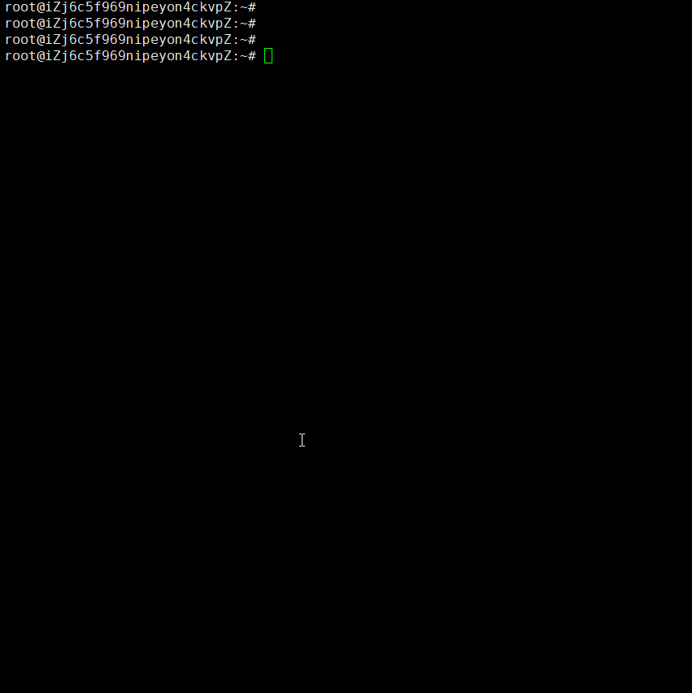

# cita-manage

一个快速部署CITA的工具，支持批量管理节点。

# 开发环境
```
Ubuntu 16.04.6
python 3.5.2
```
# 管理机环境依赖
```
apt-get update
apt-get install python3 python-dev python3-dev \
     build-essential libssl-dev libffi-dev \
     libxml2-dev libxslt1-dev zlib1g-dev \
     python3-pip
pip3 install paramiko
pip3 install cryptography==2.4.2
apt-get install docker.io

如果是非root账号需要将当前用户加入到docker组，需要sudo权限
sudo gpasswd -a ${USER} docker  #执行后重新登录终端
```
# 注意事项
脚本中变量用户、密码、服务器IP、部署目录，运行时请自行修改。
```
    username = "ops"
    passwd = "ops123456"
    remotedir = '/home/ops/'
    iplist = ['192.168.1.1','192.168.1.2','192.168.1.3','192.168.1.4']

```
确保各节点间4000端口能互通，管理机能访问节点1337-1340 端口。

配置的用户、密码、目录都正确。

# 节点环境依赖
```
apt-get update
apt-get install docker.io

如果是非root账号需要将当前用户加入到docker组，需要sudo权限
sudo gpasswd -a ${USER} docker  #执行后重新登录终端
```

# 使用,输入对应的ID即可
```
python3 cita_manage_tool.py 

1 deploy_cita
2 check_blockNumber
3 stop_cita
4 start_cita
5 check_cita_process
6 quit
```
# 录屏


